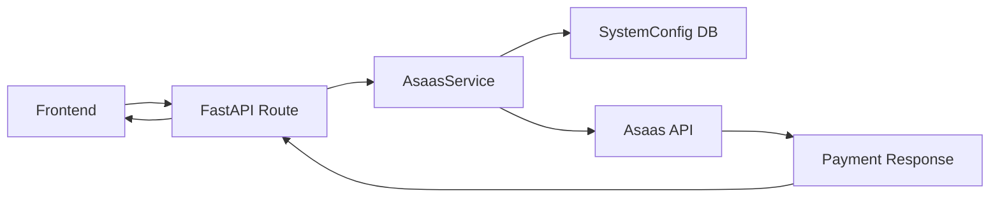

# AsaasService - Documentação Completa

## 📋 Sumário

1. [Visão Geral](#visão-geral)
2. [Arquitetura](#arquitetura)
3. [Instalação e Configuração](#instalação-e-configuração)
4. [Métodos Disponíveis](#métodos-disponíveis)
5. [Exemplos de Uso](#exemplos-de-uso)
6. [Testes](#testes)
7. [Tratamento de Erros](#tratamento-de-erros)
8. [Webhooks](#webhooks)

---

## 🎯 Visão Geral

O `AsaasService` é uma classe Python robusta que encapsula toda a comunicação com a API do Asaas Payment Gateway. Ele foi projetado para:

- ✅ **Gerenciar clientes** - Criar e recuperar clientes no Asaas
- ✅ **Criar assinaturas** - Assinaturas recorrentes mensais (PIX, Boleto, Cartão)
- ✅ **Suporte a Sandbox** - Testes seguros sem cobranças reais
- ✅ **Tratamento de erros** - Mensagens claras e logging detalhado
- ✅ **Type hints completos** - Totalmente tipado para melhor IntelliSense

---

## 🏗️ Arquitetura

```
sentinelweb/
├── services/
│   ├── __init__.py          # Exports do módulo
│   └── asaas.py             # AsaasService (classe principal)
├── models.py                # User, SystemConfig, Payment
├── database.py              # Configuração SQLAlchemy
└── main.py                  # Rotas FastAPI
```

### Fluxo de Dados



---

## ⚙️ Instalação e Configuração

### 1. Configurar Token da API

Acesse o painel administrativo:

```
http://localhost:8000/admin/config
```

Preencha:
- **Asaas API Token**: `$aact_...` (Sandbox ou Produção)
- **Sandbox Mode**: ✅ Ativado (para testes)
- **Webhook Secret**: (opcional, para sincronização automática)

### 2. Verificar Configuração no Banco

```sql
SELECT * FROM system_config;
```

Certifique-se de que `asaas_api_token` e `is_sandbox` estão definidos.

---

## 📚 Métodos Disponíveis

### `__init__(db: Session)`

Inicializa o serviço com configurações do banco de dados.

```python
from services.asaas import AsaasService

service = AsaasService(db)
```

**Exceções:**
- `AsaasAPIError` - Se configuração não for encontrada ou token estiver vazio

---

### `create_customer(user: User) -> str`

Cria ou recupera um cliente no Asaas.

**Comportamento:**
- Se `user.asaas_customer_id` já existir → retorna ele (não faz nova request)
- Se não existir → cria novo cliente na API e salva o ID no banco

**Exemplo:**

```python
from services.asaas import AsaasService

service = AsaasService(db)
customer_id = service.create_customer(user)
print(f"Cliente Asaas: {customer_id}")  # cus_000005494119
```

**Retorna:**
- `str` - ID do cliente no Asaas (ex: `cus_000005494119`)

**Exceções:**
- `AsaasAPIError` - Se API retornar erro ou não retornar ID

---

### `create_subscription(user, plan_type, billing_type='UNDEFINED')`

Cria uma assinatura recorrente mensal no Asaas.

**Parâmetros:**
- `user: User` - Objeto do usuário
- `plan_type: str` - `'pro'` ou `'agency'`
- `billing_type: str` - `'BOLETO'`, `'PIX'`, `'CREDIT_CARD'`, ou `'UNDEFINED'`

**Retorna:**
- `Tuple[bool, Optional[Dict], Optional[str]]`
  - `success: bool` - Se a operação foi bem-sucedida
  - `subscription_data: dict` - Dados completos da assinatura
  - `error: str` - Mensagem de erro (se falhar)

**Exemplo:**

```python
success, subscription, error = service.create_subscription(
    user=user,
    plan_type='pro',
    billing_type='PIX'
)

if success:
    print(f"✅ Assinatura criada!")
    print(f"Link de pagamento: {subscription['invoice_url']}")
    print(f"Valor: R$ {subscription['value']}")
else:
    print(f"❌ Erro: {error}")
```

**Dados retornados em `subscription_data`:**

```python
{
    'subscription_id': 'sub_abc123',      # ID da assinatura
    'customer_id': 'cus_abc123',          # ID do cliente
    'value': 49.90,                       # Valor mensal
    'plan': 'pro',                        # Plano contratado
    'billing_type': 'PIX',                # Forma de pagamento
    'next_due_date': '2026-01-08',        # Data da primeira cobrança
    'status': 'ACTIVE',                   # Status da assinatura
    'invoice_url': 'https://...',         # Link de pagamento
    'response': {...}                     # Resposta completa da API
}
```

---

### `get_subscription(subscription_id: str) -> Optional[Dict]`

Recupera detalhes de uma assinatura existente.

**Exemplo:**

```python
subscription = service.get_subscription('sub_abc123')
if subscription:
    print(f"Status: {subscription['status']}")
    print(f"Valor: R$ {subscription['value']}")
```

**Retorna:**
- `dict` - Dados completos da assinatura
- `None` - Se não encontrada

---

### `cancel_subscription(subscription_id: str) -> Tuple[bool, Optional[str]]`

Cancela uma assinatura ativa.

**Exemplo:**

```python
success, error = service.cancel_subscription('sub_abc123')
if success:
    print("✅ Assinatura cancelada")
else:
    print(f"❌ Erro: {error}")
```

**Retorna:**
- `Tuple[bool, str]` - (sucesso, mensagem_erro)

---

### `get_customer_subscriptions(customer_id: str) -> list`

Lista todas as assinaturas de um cliente.

**Exemplo:**

```python
subscriptions = service.get_customer_subscriptions('cus_abc123')
for sub in subscriptions:
    print(f"ID: {sub['id']} | Status: {sub['status']} | Valor: R$ {sub['value']}")
```

---

## 🚀 Exemplos de Uso

### 1. Criar Assinatura em uma Rota FastAPI

```python
from fastapi import APIRouter, Depends, HTTPException
from services.asaas import AsaasService, AsaasAPIError
from auth import get_current_user
from database import get_db

@app.post("/upgrade/checkout")
async def checkout(
    plan: str,                          # 'pro' ou 'agency'
    billing_type: str = 'PIX',          # PIX, BOLETO, CREDIT_CARD
    user: User = Depends(get_current_user),
    db: Session = Depends(get_db)
):
    try:
        service = AsaasService(db)
        success, subscription, error = service.create_subscription(
            user=user,
            plan_type=plan,
            billing_type=billing_type
        )
        
        if not success:
            raise HTTPException(status_code=400, detail=error)
        
        return {
            "success": True,
            "payment_url": subscription['invoice_url'],
            "subscription_id": subscription['subscription_id']
        }
    
    except AsaasAPIError as e:
        raise HTTPException(status_code=500, detail=str(e))
```

### 2. Verificar Status de Assinatura

```python
@app.get("/my-subscription")
async def get_my_subscription(
    user: User = Depends(get_current_user),
    db: Session = Depends(get_db)
):
    service = AsaasService(db)
    
    # Lista todas as assinaturas do usuário
    subscriptions = service.get_customer_subscriptions(user.asaas_customer_id)
    
    if not subscriptions:
        return {"message": "Nenhuma assinatura encontrada"}
    
    # Pega a primeira assinatura ativa
    active_sub = next((s for s in subscriptions if s['status'] == 'ACTIVE'), None)
    
    return {
        "subscription": active_sub,
        "status": active_sub['status'] if active_sub else None
    }
```

### 3. Cancelar Assinatura

```python
@app.post("/subscription/cancel")
async def cancel_my_subscription(
    subscription_id: str,
    user: User = Depends(get_current_user),
    db: Session = Depends(get_db)
):
    service = AsaasService(db)
    success, error = service.cancel_subscription(subscription_id)
    
    if not success:
        raise HTTPException(status_code=400, detail=error)
    
    # Atualiza plano do usuário para free
    user.plan_status = 'free'
    db.commit()
    
    return {"message": "Assinatura cancelada com sucesso"}
```

---

## 🧪 Testes

### Rota de Teste Criada

O serviço já vem com uma rota de teste completa em `main.py`:

```bash
# Criar assinatura de teste
curl -X POST "http://localhost:8000/api/test/asaas/create-subscription?plan=pro&billing_type=PIX" \
  -H "Cookie: access_token=YOUR_TOKEN"

# Buscar assinatura
curl -X GET "http://localhost:8000/api/test/asaas/get-subscription/sub_abc123" \
  -H "Cookie: access_token=YOUR_TOKEN"

# Cancelar assinatura
curl -X DELETE "http://localhost:8000/api/test/asaas/cancel-subscription/sub_abc123" \
  -H "Cookie: access_token=YOUR_TOKEN"
```

### Testar no Navegador

1. Faça login no SentinelWeb
2. Acesse: `http://localhost:8000/api/test/asaas/create-subscription?plan=pro&billing_type=PIX`
3. Copie o `payment_url` retornado
4. Acesse o link em uma nova aba
5. Faça o pagamento de teste (Sandbox aceita pagamentos fictícios)

---

## ⚠️ Tratamento de Erros

### Exceções Customizadas

```python
from services.asaas import AsaasAPIError

try:
    service.create_subscription(user, 'pro', 'PIX')
except AsaasAPIError as e:
    print(f"❌ Erro na API do Asaas: {e}")
```

### Logs Automáticos

O serviço imprime logs detalhados no console:

```
🔵 Asaas API Request: POST /subscriptions
📤 Payload: {'customer': 'cus_abc123', 'value': 49.90, ...}
📥 Response Status: 200
📥 Response Body: {'id': 'sub_abc123', ...}
✅ Assinatura criada: sub_abc123
```

### Mensagens de Erro Amigáveis

O serviço converte erros da API em mensagens legíveis:

```python
# API Error:
{
    "errors": [
        {"code": "invalid_cpf", "description": "CPF inválido"}
    ]
}

# Convertido para:
"Erro 400: CPF inválido"
```

---

## 🎣 Webhooks (Próxima Etapa)

Para sincronização automática de pagamentos, configure webhooks no Asaas:

### URL do Webhook

```
https://seu-dominio.com/webhooks/asaas
```

### Eventos Importantes

- `PAYMENT_RECEIVED` - Pagamento confirmado → Ativar plano Pro/Agency
- `PAYMENT_OVERDUE` - Pagamento vencido → Avisar usuário
- `SUBSCRIPTION_UPDATED` - Assinatura modificada → Atualizar banco

### Implementação (exemplo futuro)

```python
@app.post("/webhooks/asaas")
async def asaas_webhook(request: Request, db: Session = Depends(get_db)):
    data = await request.json()
    event_type = data.get('event')
    
    if event_type == 'PAYMENT_RECEIVED':
        payment_id = data['payment']['id']
        # Atualizar status no banco
        # Ativar plano do usuário
    
    return {"received": True}
```

---

## 📊 Valores dos Planos

Configurados em `AsaasService.PLAN_PRICES`:

```python
{
    'free': 0.0,
    'pro': 49.90,
    'agency': 149.90
}
```

Para alterar, edite a constante ou busque de `SystemConfig`.

---

## 🔒 Segurança

1. **Token nunca exposto**: Armazenado apenas no banco, nunca no frontend
2. **HTTPS obrigatório**: Em produção, use sempre HTTPS
3. **Validação de usuário**: Rotas protegidas com `get_current_user`
4. **Webhook Secret**: Valide assinatura do webhook para evitar falsificação

---

## 📖 Referências

- [Documentação Oficial Asaas](https://docs.asaas.com/reference/)
- [API Reference - Customers](https://docs.asaas.com/reference/criar-novo-cliente)
- [API Reference - Subscriptions](https://docs.asaas.com/reference/criar-assinatura)
- [Sandbox Dashboard](https://sandbox.asaas.com)

---

## ✅ Checklist de Implementação

- [x] Criar classe `AsaasService`
- [x] Implementar `create_customer()`
- [x] Implementar `create_subscription()`
- [x] Criar rotas de teste
- [x] Documentação completa
- [ ] Implementar webhooks
- [ ] Testes unitários
- [ ] Deploy em produção

---

**Desenvolvido com ❤️ para SentinelWeb**
